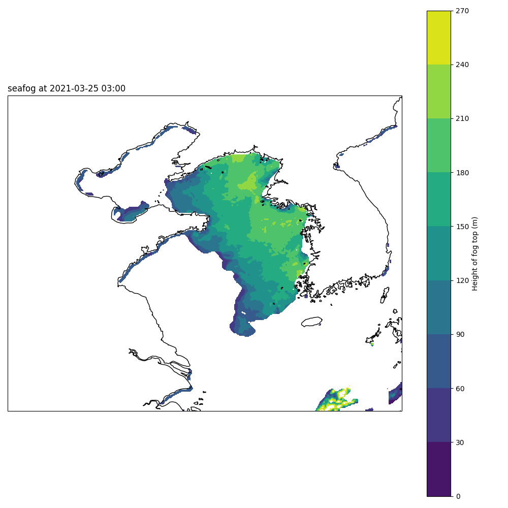

Quick Start
###########

Data Download
*************

``seafog`` comes with a lot functions to download data from various sources. Here we use function ``pgm_find_data`` to download satellite data from `Kochi University <http://weather.is.kochi-u.ac.jp/archive-e.html>`_ and function ``goos_sst_find_data`` to download NEAR-GOOS SST data from `Japan Meteorological Agency <https://www.data.jma.go.jp/gmd/goos/data/pub/JMA-product/mgd_sst_glb_D/>`_. Both of these functions will return paths of datas they download. You can go to page :doc:`../reference/pgm` and page :doc:`../reference/goos_sst` for more information about them.

.. code-block:: Python
    :caption: main.py

    from pprint import pprint
    from seafog import pgm_find_data, goos_sst_find_data

    fog_date = "2021-03-25 03:00"   # UTC time
    pgm_save_path = "data/pgm"      # the dir store PGM data
    goos_save_path = "data/goos"    # the dir store NEAR-GOOS data

    IR1, IR4, VIS, table = pgm_find_data(fog_date, pgm_save_path)
    sst = goos_sst_find_data(fog_date, goos_save_path)

    pprint([IR1, IR4, VIS, table])
    pprint(sst)

.. code-block::
    :caption: output

    ['data/pgm/HMW821032503IR1.pgm',
     'data/pgm/HMW821032503IR4.pgm',
     'data/pgm/HMW821032503VIS.pgm',
     'data/pgm/HMW821032503CAL.dat']
    'data/goos/re_mgd_sst_glb_D20210325.txt'

As you can see, all of these data are shipped in ``PGM`` or ``TXT`` format, which are not easy to parse. ``seafog`` provides ``pgm_parser`` and ``goos_sst_parser`` to reads these data and converts them to a ``xarray.DataArray`` object.

.. code-block:: Python
    :caption: main.py

    from seafog import pgm_parser, goos_sst_parser

    IR1 = pgm_parser(IR1, table, data_type="IR1")
    IR4 = pgm_parser(IR4, table, data_type="IR4")
    # use built in table to read VIS data
    VIS = pgm_parser(VIS, "", data_type="VIS-b")

    sst = goos_sst_parser(sst)

    print(IR4)
    print(sst)

.. dropdown:: IR4

    .. code-block::
        :caption: IR4

        <xarray.DataArray 'IR4' (latitude: 1800, longitude: 1800)> Size: 26MB
        array([[289.084   , 289.084   , 289.084   , ..., 298.296964, 298.078393,
                298.078393],
               [288.476   , 288.476   , 288.476   , ..., 298.296964, 298.515536,
                298.296964],
               [287.521053, 287.521053, 285.515   , ..., 299.574828, 299.781724,
                299.161034],
               ...,
               [275.911923, 272.035   , 272.035   , ..., 252.045   , 252.045   ,
                252.045   ],
               [272.035   , 267.394444, 267.394444, ..., 252.045   , 252.045   ,
                252.045   ],
               [272.635   , 272.635   , 272.635   , ..., 252.045   , 252.045   ,
                252.045   ]])
        Coordinates:
          * latitude   (latitude) float64 14kB -20.15 -20.1 -20.05 ... 69.75 69.8 69.85
          * longitude  (longitude) float64 14kB 70.15 70.2 70.25 ... 160.0 160.1 160.2
        Attributes:
            units:    K

.. dropdown:: sst

    .. code-block::
        :caption: sst

        <xarray.DataArray 'sst' (latitude: 720, longitude: 1440)> Size: 8MB
        array([[   nan,    nan,    nan, ...,    nan,    nan,    nan],
               [   nan,    nan,    nan, ...,    nan,    nan,    nan],
               [   nan,    nan,    nan, ...,    nan,    nan,    nan],
               ...,
               [271.35, 271.35, 271.35, ..., 271.35, 271.35, 271.35],
               [271.35, 271.35, 271.35, ..., 271.35, 271.35, 271.35],
               [271.35, 271.35, 271.35, ..., 271.35, 271.35, 271.35]])
        Coordinates:
          * latitude   (latitude) float64 6kB -89.88 -89.62 -89.38 ... 89.38 89.62 89.88
          * longitude  (longitude) float64 12kB 0.125 0.375 0.625 ... 359.4 359.6 359.9
        Attributes:
            units:      K
            long_name:  Sea surface temperature

Detect seafog
*************

Interpolate and mask data
=========================

Because the resolution of satellite data and SST is different, we need to interpolate them to the same resolution at first. ``NaN`` values in SST will be removed because they can affect the interpolation, so we have to mask land values after interpolating. Let's interpolate the data to a resolution of 0.0416°, which is around 4-km.

.. code-block:: Python
    :caption: main.py

    import numpy as np
    from seafog import mask_land

    # set nan in sst to -10
    sst = sst.fillna(263.16)
    latitude = np.arange(30, 42, 0.0416)
    longitude = np.arange(115, 130, 0.0416)
    # interpolate and mask data
    IR1 = IR1.interp(coords={'latitude': latitude, 'longitude': longitude})
    IR4 = IR4.interp(coords={'latitude': latitude, 'longitude': longitude})
    VIS = VIS.interp(coords={'latitude': latitude, 'longitude': longitude})
    sst = sst.interp(coords={'latitude': latitude, 'longitude': longitude})
    # mask sst value on land
    sst = mask_land(sst)

    print(IR4)
    print(sst)

.. dropdown:: IR4

    .. code-block::
        :caption: IR4

        <xarray.DataArray 'IR4' (latitude: 288, longitude: 360)> Size: 829kB
        array([[304.7446327 , 303.63705862, 301.9563908 , ..., 293.56518036,
                293.07768747, 292.6944007 ],
               [303.69617155, 302.58588381, 301.41397783, ..., 293.76631151,
                293.15638339, 292.68447471],
               [302.21298444, 301.96156143, 301.57837611, ..., 293.41113564,
                293.04995313, 292.60829291],
               ...,
               [286.32311971, 290.95255123, 296.10891178, ..., 283.31800068,
                276.54509034, 266.38012904],
               [290.83237083, 294.41365068, 296.1723544 , ..., 278.99295254,
                271.94069428, 265.22834856],
               [294.14473098, 296.05390429, 294.84680727, ..., 268.99043404,
                263.59382626, 262.68522462]])
        Coordinates:
          * latitude   (latitude) float64 2kB 30.04 30.08 30.12 ... 41.92 41.96 42.0
          * longitude  (longitude) float64 3kB 115.0 115.1 115.1 ... 129.9 130.0 130.0
        Attributes:
            units:    K

.. dropdown:: sst

    .. code-block::
        :caption: sst

        <xarray.DataArray 'sst' (latitude: 289, longitude: 361)> Size: 835kB
        array([[         nan,          nan,          nan, ..., 294.92492   ,
                294.98316   , 295.0414    ],
               [         nan,          nan,          nan, ..., 295.05927802,
                295.08152237, 295.10376672],
               [         nan,          nan,          nan, ..., 295.19363603,
                295.17988474, 295.16613344],
               ...,
               [         nan,          nan,          nan, ...,          nan,
                275.90174463, 276.23177174],
               [         nan,          nan,          nan, ...,          nan,
                         nan, 274.86701885],
               [         nan,          nan,          nan, ...,          nan,
                         nan,          nan]])
        Coordinates:
          * latitude   (latitude) float64 2kB 30.0 30.04 30.08 ... 41.9 41.94 41.98
          * longitude  (longitude) float64 3kB 115.0 115.0 115.1 ... 129.9 129.9 130.0
        Attributes:
            units:      K
            long_name:  Sea surface temperature

Calculate marine fog area and the height of fog top
===================================================

We will use ``detect_seafog.daytime_seafog`` to calculate marine fog area and the height of its top at daytime.

.. code-block:: Python
    :caption: main.py

    import matplotlib.pyplot as plt
    from cartopy import crs
    from seafog import detect_seafog

    detect_seafog.IR_sst_diff_range = (0, 35)
    seafog = detect_seafog.daytime_seafog(fog_date, IR1, IR4, VIS, sst)

    fig = plt.figure(figsize=(10, 10))
    proj = crs.PlateCarree()
    ax = fig.add_subplot(111, projection=crs.PlateCarree(central_longitude=180))
    im = ax.contourf(seafog['longitude'], seafog['latitude'], seafog, levels=np.arange(0, 300, 30), transform=proj)
    ax.coastlines()
    ax.set_title(f"seafog at {fog_date}", loc='left')
    cbar = fig.colorbar(mappable=im)
    cbar.set_label("Height of fog top (m)")
    plt.show()

